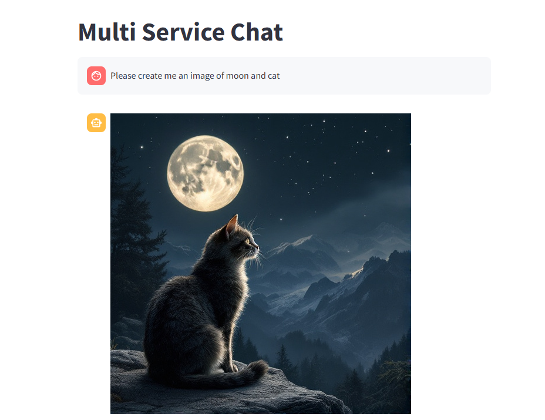
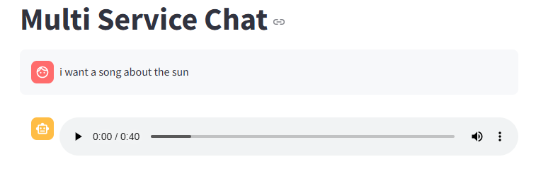
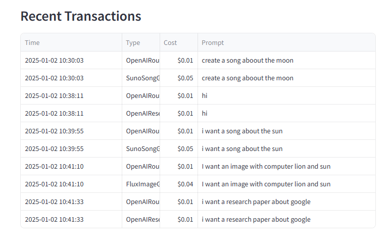

# Multi-Service Chat Application

A versatile chatbot application that provides three distinct services: image generation, music generation, and research paper creation. The application uses a smart routing system to direct user requests to the appropriate service.

**User Chat Demo**


**Cost Management Tracker**


## Features

- 🎨 **Image Generation**: Creates images based on text descriptions
- 🎵 **Music Generation**: Composes unique songs from text prompts
- 📚 **Research Generation**: Produces research papers on requested topics
- 💡 **Smart Routing**: Automatically detects user intent and routes to appropriate service
- 💰 **Budget Management**: Tracks API usage costs
- 🔄 **Real-time Streaming**: Supports streaming responses for research generation

## Quick Start
For a detailed walkthrough of the system's features and capabilities, check out our interactive Jupyter notebook:

[User Guide Notebook](User_Guide.ipynb)

This notebook contains:

 - Running the server
 - Running the UI
 - Running tests
 - Usage examples

## Prerequisites

- Python 3.8 or higher
- pip package manager
- Virtual environment (recommended)

## Installation

1. **Clone the Repository**
   ```bash
   git clone https://github.com/Miriam2040/Multi-Service-Chat.git
   cd multi-service-chat
   ```

2. **Create and Activate Virtual Environment**
   ```bash
   # On Windows
   python -m venv venv
   .\venv\Scripts\activate

   # On macOS/Linux
   python3 -m venv venv
   source venv/bin/activate
   ```

3. **Install Project Dependencies**
   ```bash
   pip install -r requirements.txt
   ```

4. **Install Flux Dependencies**
   ```bash
   cd $HOME && git clone https://github.com/black-forest-labs/flux
   cd $HOME/flux
   python3.10 -m venv .venv
   source .venv/bin/activate
   pip install -e ".[all]"
   ```

## Environment Configuration

### Required API Keys
Create a `.env` file in the root directory with the following API keys:

```env
# Required API Keys
BFL_API_KEY=your_flux_api_key        # For image generation
UDIO_API_KEY=your_suno_api_key       # For music generation
OPENAI_API_KEY=your_openai_api_key   # For research and routing
```

To obtain these keys:
- Flux API Key: Register at [Black Forest Labs](https://api.bfl.ml/auth/login)
- Suno API Key: Sign up at [Suno AI](https://www.suno.ai)
- OpenAI API Key: Create at [OpenAI Platform](https://udioapi.pro)

### Configurable Settings
The following settings can be adjusted in `src/config.py`:

```python
# System Settings
MODE = 'PRODUCTION'    # 'PRODUCTION' for real APIs 'DEV' for moch usage for dev/testing
BUDGET = 20           # Total budget limit in currency units

# Image Generation Settings
IMAGE_API_KEY         # API key for BFL service
IMAGE_GENERATION_MODEL = "flux.1.1-pro"  # Model to use for image generation
IMAGE_WIDTH = 512     # Output image width  
IMAGE_HEIGHT = 512    # Output image height
IMAGE_COST = 0.04     # Cost per image generation request

# Song Generation Settings 
SONG_GENERATION_TOKEN # API key for UDIO service
SONG_GENERATION_URL   # API endpoint for song generation
SONG_GENERATION_MODEL = "chirp-v3.0"  # Model to use for music generation
SONG_COST = 0.05      # Cost per song generation request
SONG_FEED_URL         # API endpoint for retrieving generated songs
SONG_TEMPERATURE = 0.9 # Creativity level for music generation (0.0-1.0)

# Research Settings
RESEARCH_API_KEY      # OpenAI API key
RESEARCH_MODEL_NAME = "gpt-4o-mini"  # Model to use for research
RESEARCH_COST = 0.01  # Cost per research request
RESEARCH_MAX_TOKENS = 4000  # Maximum length of research output
RESEARCH_SYSTEM_MESSAGE  # System prompt for research generation

# Router Settings
ROUTER_MODEL_NAME = "gpt-4o-mini"  # Model for intent classification
ROUTER_API_KEY        # API key (reuses OpenAI key)
ROUTER_COST = 0.01    # Cost per routing request
ROUTER_SYSTEM_MESSAGE # System prompt for intent classification
```

## Starting the Application

### 1. Start the Backend Server
Start the FastAPI backend server:
```bash
uvicorn src.services.service:app --reload --port 8000
```

### 2. Launch the User Interface
In a new terminal, start the Streamlit frontend:
```bash
streamlit run src/ui/chat.py
```

The application will be available at:
- Frontend UI: http://localhost:8501
- Backend API: http://localhost:8000

## Usage Guide

The application consists of two main tabs:

### Chat Tab
This is where you interact with the AI system:

1. **Image Generation**
   ```plaintext
   User: "Create an image of a moon and cat"
   ```
   - The system will display the generated image
   - Generation typically takes 10-20 seconds
   - Images are displayed directly in the chat
  
   

2. **Music Generation**
   ```plaintext
   User: "Make me a song about sun"
   ```
   - An audio player will appear with the generated song
   - Generation typically takes 30-60 seconds
   - Songs can be played, paused, and downloaded

    

3. **Research Generation**
   ```plaintext
   User: "I want research paper about google"
   ```
   - Research content streams in real-time
   - You'll see the text appear progressively
   - Final output is formatted as a complete research paper
  
   

### Cost Monitoring Tab
Tracks usage and costs:
- Current budget usage
- Remaining budget
- Cost per service type
- latest transactions

   
   

## Architecture Overview

The application follows a clean, modular architecture:

### Frontend Layer (`app.py`)
- Built with Streamlit
- Handles user interface and interactions
- Manages chat history and media display
- Streams content updates to UI

### Backend Service (`service.py`)
- FastAPI-based REST API
- Handles content generation requests
- Manages streaming responses
- Implements logging and error handling

### Router System
- Two implementations:
  1. `MockRouter`: For development/testing
  2. `OpenAIRouter`: For production use, using model to classify user propmt to the right categoy
- Intelligently routes requests to appropriate generators

### Content Generators
1. **Image Generator**
   - `FluxImageGenerator`: Uses Flux API
   - `MockImageGenerator`: For testing
   - Handles image prompt processing and generation

2. **Song Generator**
   - `SunoSongGenerator`: Uses Suno API
   - `MockSongGenerator`: For testing
   - Manages audio generation and processing

3. **Research Generator**
   - `OpenAIResearchGenerator`: Uses OpenAI API
   - `MockResearchGenerator`: For testing
   - Implements streaming response generation

### Base Classes (`base.py`)
- `ContentGeneratorBase`: Abstract base for all generators
- `RouterBase`: Abstract base for routing systems
- `ContentType`: Enum for content types
- Defines common interfaces and types

### Configuration System (`config.py`)
- Centralizes configuration management
- Handles environment variables
- Manages API keys and settings

### Cost Tracking System
- **Budget Management**
  - Tracks overall budget limit from config
  - Maintains running total of expenses
  - Prevents operations when budget is exceeded

- **Per-Service Cost Tracking**
  - Image Generation: $0.04 per request
  - Song Generation: $0.05 per request
  - Research Generation: $0.01 per request
  - Routing: $0.01 per request

- **Implementation Details**
  - Each generator implements `get_price()` method
  - Costs are tracked before API calls
  - Real-time budget updates
  - Cost monitoring dashboard in UI

- **Transaction Storage**
  - All transactions are saved to disk in JSON format
  - Located at `data/costs/costs.json`
  - Each transaction includes timestamp, service type, cost, and status
  - Example transaction record:
    ```json
    {
       {
        "id": "b05eeb81-b5a6-4df0-b4ca-f8129ffca258",
        "timestamp": "2025-01-02T10:30:03.892170",
        "type": "SunoSongGenerator",
        "cost": 0.05,
        "prompt": "create a song aboout the moon"
      },
      {
        "id": "2743f7cf-159c-4135-ab60-bed1e9cbfbc1",
        "timestamp": "2025-01-02T10:38:11.561070",
        "type": "OpenAIRouter",
        "cost": 0.01,
        "prompt": "hi"
      },
      {
        "id": "ced87ccf-f580-4dfd-9b66-2d0d3e4593f5",
        "timestamp": "2025-01-02T10:38:11.568626",
        "type": "OpenAIResearchGenerator",
        "cost": 0.01,
        "prompt": "hi"
      }
    }
   
- **Cost Optimization**
  - DEV mode for testing without costs
  - Usage analytics for cost optimization

## Error Handling

The application includes comprehensive error handling for:
- API failures
- Budget limits
- Invalid requests
- Network issues

## Contributing

1. Fork the repository
2. Create a feature branch
3. Commit your changes
4. Push to the branch
5. Create a Pull Request

## Support

For support, please open an issue in the repository.

## Next Steps

The following improvements and features are planned for future development:

### User Experience
- Add user authentication and individual user budgets
- Implement history saving and chat session persistence
- Add the ability to favorite and share generated content
- Create a gallery view for previously generated images and songs
- Add export functionality for research papers in different formats (PDF, Word) and for images (PNG, JPEG)

### Technical Improvements
- Implement caching to reduce API costs for similar requests
- Add retry mechanisms for failed API calls
- Implement batch processing for multiple requests

### Scalability
- Implement load balancing for high traffic
- Add database support for storing generation history
- Implement rate limiting per user/IP
- Implement job queues for long-running tasks

## Acknowledgments

- OpenAI for GPT API
- Flux for image generation
- Suno for music generation
