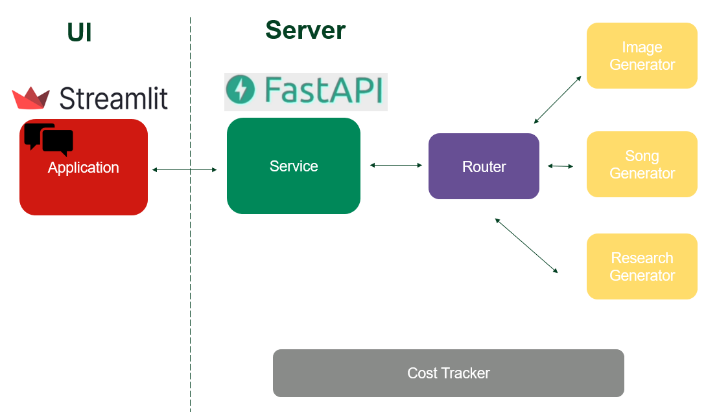

# Technical Documentation: Multi-Service Chatbot Implementation

## Technology Choices

### 1. FastAPI Framework
FastAPI was selected as the backend framework for several key reasons:
- **Performance**: One of the fastest Python frameworks available, with performance on par with NodeJS and Go
- **Modern Features**: Native async support, automatic OpenAPI documentation
- **Type Safety**: Built-in Pydantic integration for request/response validation
- **Developer Experience**: Excellent documentation, intuitive API design
- **Scalability**: Easy to scale horizontally with modern deployment practices
- **Streaming Support**: Native support for streaming responses, crucial for real-time content generation

### 2. Streamlit Frontend
Streamlit was chosen as the frontend solution for these advantages:
- **Rapid Development**: Allows quick creation of interactive UIs with Python
- **Real-time Updates**: Native support for real-time data streaming
- **Media Handling**: Built-in components for images, audio, and text display
- **State Management**: Simple session state handling
- **Python Integration**: Seamless integration with Python backend services
- **Chat Interface**: Native support for chat-like interfaces
- **Deployment Simplicity**: Easy to deploy and maintain

### 3. Flux for Image Generation
According to the text to image [Leaderboard](https://artificialanalysis.ai/text-to-image), Flux was selected as the image generation service because:
- **Cost Efficiency**: Provides competitive pricing compared to alternatives
- **Performance**: High-quality output with fast generation times
- **API Reliability**: Stable API with good uptime
- **Output Quality**: Consistently high-quality image generation
- **Integration Ease**: Well-documented API with Python SDK

### 4. Suno for song Generation
According to research about the best song generations services [Review](https://kripeshadwani.com/ai-music-generators/), Suno was selected as the song generation service:
- **Cost Efficiency**: Provides competitive pricing compared to alternatives
- **Performance**: High-quality output with fast generation times
- **API Reliability**: Stable API with good uptime
- **Output Quality**: Consistently high-quality image generation
- **Integration Ease**: Well-documented API with Python SDK

## Architecture Overview

 

The multi-service chatbot implementation follows a modular, service-oriented architecture designed for extensibility, maintainability, and robust error handling. Here are the key components and design decisions:

### 1. Core Architecture Components

#### Base Classes and Abstractions
- Implemented abstract base classes (`ContentGeneratorBase` and `RouterBase`) to enforce consistent interfaces
- Used the Strategy pattern to allow different implementations of content generators
- Leveraged Python's ABC (Abstract Base Class) module to ensure proper interface implementation
- Defined an enumerated type `ContentType` to ensure type safety across the system

#### Routing System
- Two-tier routing architecture:
  - `MockRouter` for development/testing
  - `OpenAIRouter` for production
- Intelligent routing using OpenAI's API with enfornce output json schema to let LLM classify the propmt intent
- Factory pattern implementation for creating appropriate generators

#### Content Generators
- Independent implementations for each content type:
  - FluxImageGenerator for images
  - SunoSongGenerator for music
  - OpenAIResearchGenerator for research
- Mock implementations for testing and development

### 2. Key Design Decisions

#### Error Handling and Logging
- Custom `GenerationError` class for specific error handling
- Comprehensive logging system with both file and console outputs
- Detailed request tracking using unique request IDs
- Structured error responses using FastAPI's exception handling

#### Development Mode
- Implemented a DEV/PROD mode switch in configuration
- Mock generators with simulated delays for testing
- Separate routing logic for development and production

#### API Integration
- Custom SSL adapter for development environments
- Streaming support for compatible generators
- Robust polling mechanism for asynchronous operations (e.g., song generation)
- Timeout handling and retry logic for external API calls

#### Frontend Integration
- Streamlit-based user interface
- Support for multiple content types (text, audio, images)
- Real-time streaming updates for research generation
- Session state management for chat history

### 3. Security Considerations

#### API Key Management
- Environment variable-based API key storage
- Custom getter function with validation
- Separate keys for different services

#### SSL Handling
- Custom SSL adapter for development
- Proper SSL verification in production
- Configurable SSL settings per environment

### 4. Cost Management

#### Budget Tracking
- Per-service cost tracking
- Global budget limit configuration
- Cost-aware routing decisions
- Price estimation before generation

### 5. Scalability Considerations

#### Modular Design
- Easy addition of new content generators
- Pluggable routing system
- Environment-specific configurations
- Independent service implementations

#### Performance Optimization
- Streaming responses for large content
- Efficient memory usage
- Configurable timeouts and retry logic
- Batch processing capabilities

### 6. Testing Strategy

#### Mock Implementations
- Mock generators for all content types
- Configurable delays for realistic testing
- Sample content for consistent testing
- Development mode for integration testing

### 7. Future Extensibility

The architecture supports several potential enhancements:
- Additional content types through new generator implementations
- Alternative routing strategies
- New frontend interfaces
- Enhanced monitoring and analytics
- Cost optimization algorithms
- Load balancing capabilities

### 8. Technical Debt and Limitations

Current known limitations:
- Single-threaded content generation
- Basic cost tracking implementation
- Limited error recovery options
- Simple routing logic in development mode
- Basic session management

### 9. Development Environment

#### Configuration Management
- Environment-specific settings
- Configurable API endpoints
- Adjustable generation parameters
- Development/Production mode switch

#### Dependency Management
- Core dependencies:
  - FastAPI for API framework
  - Streamlit for frontend
  - OpenAI for routing and research
  - Custom clients for image and song generation

### 10. Monitoring and Maintenance

#### Logging System
- Structured logging format
- Separate log files per service
- Debug level configuration
- Request tracking through unique IDs

#### Error Tracking
- Detailed error messages
- Stack trace preservation
- Error categorization
- Client-friendly error responses

## Conclusion

The implementation prioritizes:
- Code maintainability through clear abstractions
- Robust error handling and logging
- Flexible configuration management
- Easy testing and development
- Secure API integration
- Cost-aware operation

These design decisions create a solid foundation for future enhancements while maintaining current functionality in a production-ready state.
